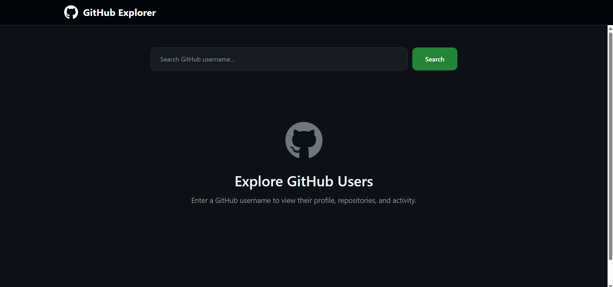
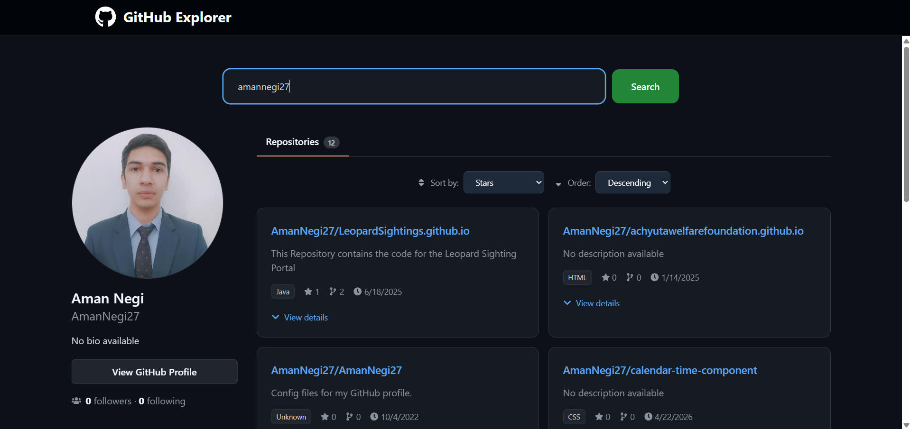

# GitHub Explorer

## Project Description

This project is my submission for **Exercise 3: GitHub Repo Explorer** from the Studio Graphene Full Stack Developer assessment.

GitHub Explorer is a full-stack web application that allows users to search for any GitHub profile and view detailed information about the user along with their public repositories. The application uses a Node.js backend as a proxy to the GitHub API and a React frontend for an interactive user experience.

---

## Screenshots

### Landing Page



The landing page allows users to search GitHub profiles through a custom Node.js backend while providing a clean GitHub-inspired interface.

---

### User Profile & Repository Explorer



Displays user profile information, repository statistics, sorting options, expandable repository details, and repository pagination.

---

## Features

### User Profile

* Search GitHub users by username
* Display:

  * Avatar
  * Name
  * Bio
  * Followers count
  * Following count
  * Public repository count
  * Location
  * Website / Blog links

### Repository Explorer

* View all public repositories
* Sort repositories by:

  * Stars
  * Name
  * Last Updated
* Repository pagination
* Expandable repository details
* View repository metadata

### Additional Features

* Server-side caching (60 seconds)
* Loading states
* Error handling
* Responsive GitHub-inspired UI
* Backend proxy for GitHub API requests

---

## Live Demo

Frontend:

```text
https://github-explorer-three-psi.vercel.app
```

Backend:

```text
https://github-explorer-u5wc.onrender.com
```

---

## Tech Stack

### Frontend

* React
* Vite
* Tailwind CSS
* Axios
* React Icons

### Backend

* Node.js
* Express.js
* Axios
* Node Cache

### Why These Technologies?

* React for component-based UI development
* Vite for fast development and build performance
* Tailwind CSS for rapid responsive styling
* Express.js for REST API creation
* Axios for API communication
* Node Cache for reducing GitHub API requests and handling rate limits

---

## How To Run Locally

### Clone Repository

```bash
git clone https://github.com/priyanshupundir/github-explorer.git
cd github-explorer
```

### Install Backend Dependencies

```bash
cd server
npm install
```

### Start Backend

```bash
npm start
```

Backend runs on:

```text
http://localhost:5000
```

### Install Frontend Dependencies

```bash
cd ../client
npm install
```

### Start Frontend

```bash
npm run dev
```

Frontend runs on:

```text
http://localhost:5173
```

---

## API Documentation

### Get GitHub User Information

#### Request

```http
GET /api/github/:username
```

Example:

```http
GET /api/github/torvalds
```

#### Response

```json
{
  "user": {
    "login": "torvalds",
    "name": "Linus Torvalds",
    "followers": 100000,
    "following": 0,
    "public_repos": 10
  },
  "repos": [
    {
      "name": "linux",
      "description": "Linux kernel source tree",
      "language": "C",
      "stargazers_count": 100000
    }
  ]
}
```

#### Error Response

```json
{
  "message": "User not found"
}
```

---

## Project Structure

```text
github-explorer/
│
├── client/
│   ├── src/
│   │   ├── components/
│   │   ├── assets/
│   │   ├── App.jsx
│   │   └── main.jsx
│
├── server/
│   ├── server.js
│   └── package.json
│
└── README.md
```

---

## Next Steps

Given more time, I would implement:

* Recently searched users using localStorage
* Repository language statistics charts
* Debounced search suggestions
* Unit and integration testing
* Deployment monitoring and analytics

---

## References & Acknowledgements

### Design Inspiration

* GitHub

  * https://github.com

### Tutorials & Learning Resources

* ASMRProg - GitHub Dashboard UI Tutorial

  * https://youtu.be/RM9LXkrY7Bk

### Documentation

* React Documentation

  * https://react.dev

* Vite Documentation

  * https://vitejs.dev

* Express.js Documentation

  * https://expressjs.com

* Tailwind CSS Documentation

  * https://tailwindcss.com

* GitHub REST API Documentation

  * https://docs.github.com/en/rest

### Notes

The overall UI design was inspired by GitHub's profile interface and the ASMRProg GitHub Dashboard tutorial. The application was adapted and extended with additional functionality including server-side caching, repository pagination, repository detail expansion, improved error handling, and a custom backend API proxy.


## Author

Priyanshu Pundir

GitHub:
https://github.com/priyanshupundir
